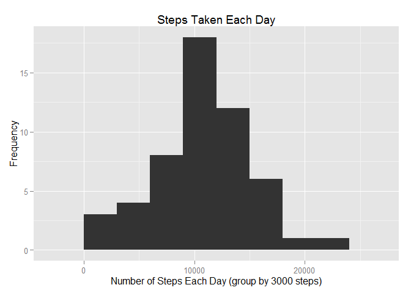
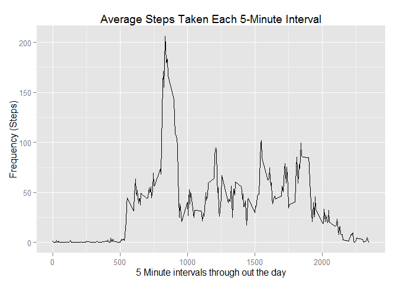
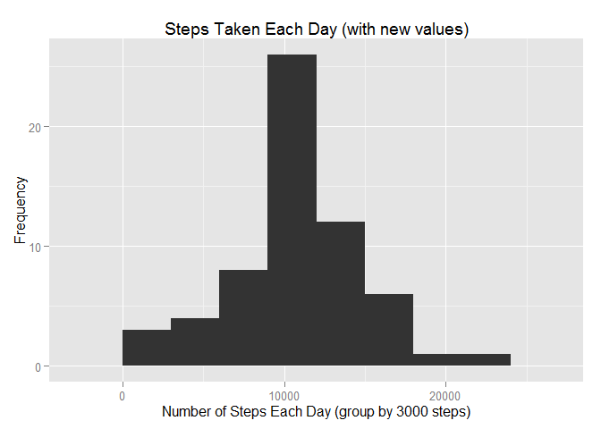
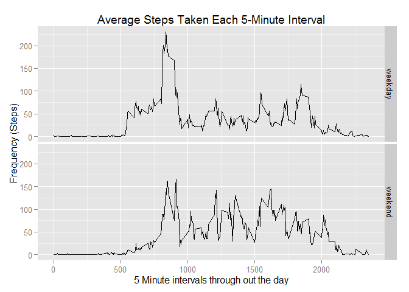

# Reproducible Research: Peer Assessment 1


## Loading and preprocessing the data

clone the forked repo to local drive by using "git clone http....."

```r
rm(list=ls())
unzip("activity.zip")
actdata <- read.csv("activity.csv")
head(actdata)
```

```
##   steps       date interval
## 1    NA 2012-10-01        0
## 2    NA 2012-10-01        5
## 3    NA 2012-10-01       10
## 4    NA 2012-10-01       15
## 5    NA 2012-10-01       20
## 6    NA 2012-10-01       25
```
## What is mean total number of steps taken per day?

Personal note, to review aggregate function, refer to https://github.com/hauwou/Getting-and-Cleaning-Data-Project

###1. Calculate the total number of steps taken per day

```r
totalSteps<-aggregate(steps ~ date, data = actdata, FUN=sum, na.rm = TRUE)
head(totalSteps)
```

```
##         date steps
## 1 2012-10-02   126
## 2 2012-10-03 11352
## 3 2012-10-04 12116
## 4 2012-10-05 13294
## 5 2012-10-06 15420
## 6 2012-10-07 11015
```

```r
length(totalSteps$steps)
```

```
## [1] 53
```


###2. Make a histogram of the total number of steps taken each day

```r
library("ggplot2")
```

```
## Warning: package 'ggplot2' was built under R version 3.1.3
```

```r
plot1 <- ggplot(totalSteps, aes(x = steps)) 
plot1 <- plot1 + geom_histogram(binwidth=3000) 
plot1 <- plot1 + labs(title="Steps Taken Each Day", 
             x = "Number of Steps Each Day (group by 3000 steps)", y = "Frequency") 

plot1
```

 


###3. Calculate and report the mean and median of the total number of steps taken per day

```r
mean(totalSteps$steps)
```

```
## [1] 10766.19
```

```r
median(totalSteps$steps)
```

```
## [1] 10765
```

## What is the average daily activity pattern?

###1. Make a time series plot (i.e. type = "l") of the 5-minute interval (x-axis) and the average number of steps taken, averaged across all days (y-axis)


```r
avgIntervalSteps<-aggregate(steps ~ interval, data = actdata, FUN=mean, na.rm = TRUE)
head(avgIntervalSteps)
```

```
##   interval     steps
## 1        0 1.7169811
## 2        5 0.3396226
## 3       10 0.1320755
## 4       15 0.1509434
## 5       20 0.0754717
## 6       25 2.0943396
```

```r
plot2 <- ggplot(avgIntervalSteps, aes(x = interval, y=steps)) 
plot2 <- plot2 + geom_line() 
plot2 <- plot2 + labs(title="Average Steps Taken Each 5-Minute Interval", 
             x = "5 Minute intervals through out the day", y = "Frequency (Steps)") 

plot2
```

 

###2. Which 5-minute interval, on average across all the days in the dataset, contains the maximum number of steps?

Use which.max to find the row number that contains the max steps value, then use the row number to find the value of the "interval" column

```r
#summary(avgIntervalSteps)
avgIntervalSteps[which.max(avgIntervalSteps$steps),1]
```

```
## [1] 835
```
## Imputing missing values

###Note that there are a number of days/intervals where there are missing values (coded as NA). The presence of missing days may introduce bias into some calculations or summaries of the data.

###1. Calculate and report the total number of missing values in the dataset (i.e. the total number of rows with NAs)


```r
totalMissings <- sum(is.na(actdata$steps))
totalMissings
```

```
## [1] 2304
```
###2. Devise a strategy for filling in all of the missing values in the dataset. The strategy does not need to be sophisticated. For example, you could use the mean/median for that day, or the mean for that 5-minute interval, etc.

Use the mean steps of 5-minute intervals, since those values are just obtained in step 2

###3. Create a new dataset that is equal to the original dataset but with the missing data filled in.


```r
newActData <- actdata

for (i in 1:length(newActData$steps)) {
    if (is.na(newActData[i,1])) {
      intervalNum <- newActData[i,3]
      x <- which(avgIntervalSteps$interval == intervalNum)
      
      stepsVal <- avgIntervalSteps[which(avgIntervalSteps$interval == intervalNum), 2]
      newActData[i,1] <- stepsVal
      }
    }

head(newActData)
```

```
##       steps       date interval
## 1 1.7169811 2012-10-01        0
## 2 0.3396226 2012-10-01        5
## 3 0.1320755 2012-10-01       10
## 4 0.1509434 2012-10-01       15
## 5 0.0754717 2012-10-01       20
## 6 2.0943396 2012-10-01       25
```

###4. Make a histogram of the total number of steps taken each day and Calculate and report the mean and median total number of steps taken per day. Do these values differ from the estimates from the first part of the assignment? What is the impact of imputing missing data on the estimates of the total daily number of steps?

Almost the same mean and median values. Obviously, impute missing step values will add to the total daily number of steps.


```r
sum(is.na(newActData$steps))
```

```
## [1] 0
```

```r
newTotalSteps<-aggregate(steps ~ date, data = newActData, FUN=sum, na.rm = TRUE)
head(totalSteps)
```

```
##         date steps
## 1 2012-10-02   126
## 2 2012-10-03 11352
## 3 2012-10-04 12116
## 4 2012-10-05 13294
## 5 2012-10-06 15420
## 6 2012-10-07 11015
```

```r
head(newTotalSteps)
```

```
##         date    steps
## 1 2012-10-01 10766.19
## 2 2012-10-02   126.00
## 3 2012-10-03 11352.00
## 4 2012-10-04 12116.00
## 5 2012-10-05 13294.00
## 6 2012-10-06 15420.00
```

```r
mean(newTotalSteps$steps)
```

```
## [1] 10766.19
```

```r
median(newTotalSteps$steps)
```

```
## [1] 10766.19
```

```r
mean(totalSteps$steps)
```

```
## [1] 10766.19
```

```r
median(totalSteps$steps)
```

```
## [1] 10765
```

```r
sum(totalSteps$steps)
```

```
## [1] 570608
```

```r
sum(newTotalSteps$steps)
```

```
## [1] 656737.5
```

```r
plot3 <- ggplot(newTotalSteps, aes(x = steps)) 
plot3 <- plot3 + geom_histogram(binwidth=3000) 
plot3 <- plot3 + labs(title="Steps Taken Each Day (with new values)", 
             x = "Number of Steps Each Day (group by 3000 steps)", y = "Frequency") 

plot3
```

 


## Are there differences in activity patterns between weekdays and weekends?


###For this part the weekdays() function may be of some help here. Use the dataset with the filled-in missing values for this part.

###1. Create a new factor variable in the dataset with two levels - "weekday" and "weekend" indicating whether a given date is a weekday or weekend day.


```r
newActData$dayType <- ifelse(weekdays(as.Date(newActData$date)) %in% c("Saturday", "Sunday"), "weekend", "weekday")

head(newActData)
```

```
##       steps       date interval dayType
## 1 1.7169811 2012-10-01        0 weekday
## 2 0.3396226 2012-10-01        5 weekday
## 3 0.1320755 2012-10-01       10 weekday
## 4 0.1509434 2012-10-01       15 weekday
## 5 0.0754717 2012-10-01       20 weekday
## 6 2.0943396 2012-10-01       25 weekday
```


###2. Make a panel plot containing a time series plot (i.e. type = "l") of the 5-minute interval (x-axis) and the average number of steps taken, averaged across all weekday days or weekend days (y-axis). See the README file in the GitHub repository to see an example of what this plot should look like using simulated data.

People start stepping earlier during the weekdays (sleeping in during the weekend?).  People walk more through out the day during the weekend. During the weekday, people get up, walk during their workday prep routine, get to work and walk a larger distance to their work place (from the parking lot?), and then settle in a sedentary routines.


```r
newAvgIntervalSteps<-aggregate(steps ~ interval + dayType, data = newActData, FUN=mean, na.rm = TRUE)
head(newAvgIntervalSteps)
```

```
##   interval dayType      steps
## 1        0 weekday 2.25115304
## 2        5 weekday 0.44528302
## 3       10 weekday 0.17316562
## 4       15 weekday 0.19790356
## 5       20 weekday 0.09895178
## 6       25 weekday 1.59035639
```

```r
plot4 <- ggplot(newAvgIntervalSteps, aes(x = interval, y=steps)) 
plot4 <- plot4 + geom_line() 
plot4 <- plot4 + labs(title="Average Steps Taken Each 5-Minute Interval", 
             x = "5 Minute intervals through out the day", y = "Frequency (Steps)")  
plot4 <- plot4 + facet_grid (dayType~.)

plot4
```

 
